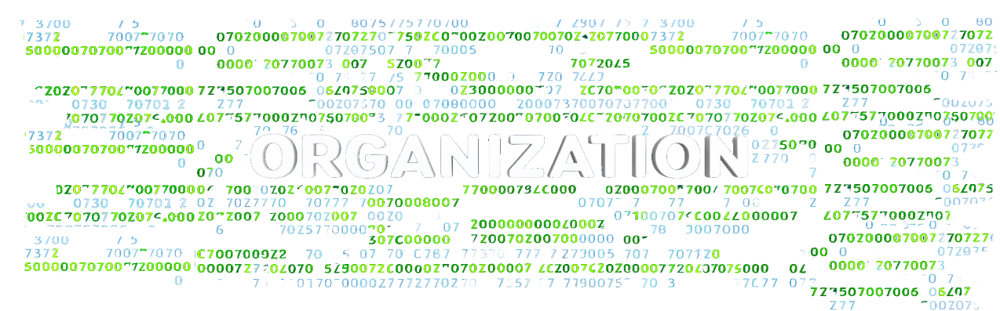

# ⚠️ DO NOT VIEW UNTIL YOU HAVE COMPLETED THE KATA ⚠️

**Attention:** This document contains detailed organizational information and a Figma screenshot that could provide hints or ideas about how to solve the kata. Please do not view this until you have completed the task on your own.

## Welcome, again"dear" developer!
---
*Before proceeding, make sure to right-click on this `README.md` and choose "Preview" mode to enhance your reading experience.*

---
# 📋 ORGANIZATION 📋:

After going through the materials TOM gave us on equivalence partitioning, boundary value analysis, and decision table testing, I decided to use equivalence partitioning for this project. I picked this method because it helps cover a wide range of possible inputs with fewer test cases, making sure we test everything thoroughly.

The table below illustrates the various categories of input values and their expected outputs based on this method:

| **Input Category**               | **Range**                         | **Expected Output**                           |
|---------------------------------|-----------------------------------|----------------------------------------------|
| **String Input**                 | Any non-numeric string             | "Letters? This isn't Wordle!"                |
| **NaN Input**                    | `NaN`                              | "Not a number. Is this modern art?"         |
| **Negative Score**               | Less than 0                        | "Negative score? Did you even try?"         |
| **Score of 0**                   | Exactly 0                          | "Zero? Didn't write your name?"             |
| **Score Between 1 and 19**       | From 1 to 19                       | "At least you tried... sort of."            |
| **Score Between 20 and 49**      | From 20 to 49                      | "Almost there... if you're aiming low."     |
| **Score Between 50 and 69**      | From 50 to 69                      | "Mediocre, just mediocre."                  |
| **Score Between 70 and 99**      | From 70 to 99                      | "Great job! For a robot."                   |
| **Score of 100**                 | Exactly 100                        | "100? Do you have a life?"                  |
| **Score Greater than 100**       | More than 100                      | "Overachiever much?"                        |
| **Undefined Input**              | `undefined`                        | "That doesn't even make sense!"             |
| **Null Input**                   | `null`                             | "That doesn't even make sense!"             |
| **Object Input**                 | Any object                         | "That doesn't even make sense!"             |

---

## Flowchart Screenshot

Below is a screenshot of the flowchart that outlines the logic and flow of the `SarcasticScoreToString` function. This visual representation may provide additional context on how the function processes different types of input.

---

## 🎉 Farewell and Final Thoughts 🎉

---
I’ve put a lot of effort into organizing this document to make sure it’s as clear and helpful as possible. If you have any feedback or need further assistance, feel free to reach out. Happy coding! 🚀😊

---
